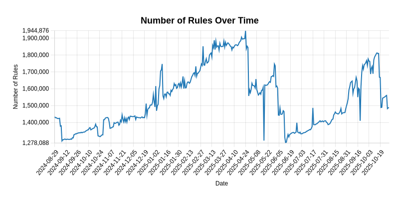

# ad-block-list-regroup

This repository contains a collection of adblock filter lists for adguard home. Each entry in the list corresponds to a source used to generate the adblock list.

## How install

Add link in filter

https://raw.githubusercontent.com/alexyle/adblock-list-regroup/main/adblock-list-regroup.txt

## Info

Last update: 2026-01-28

Filter: 155

Rule: 1621842

## Sources

| Name | Source |
|------|--------|
| 1Hosts (Lite) | https://adguardteam.github.io/HostlistsRegistry/assets/filter_24.txt |
| 1Hosts (mini) | https://adguardteam.github.io/HostlistsRegistry/assets/filter_38.txt |
| ABP filters | https://easylist-downloads.adblockplus.org/abp-filters-anti-cv.txt |
| ABPindo | https://raw.githubusercontent.com/ABPindo/indonesianadblockrules/master/subscriptions/abpindo.txt |
| ABPVN List | https://abpvn.com/filter/abpvn-FCfc5D.txt?adguard |
| abuse.ch URLhaus Host file | https://urlhaus.abuse.ch/downloads/hostfile/ |
| Ad filter list by Disconnect | https://s3.amazonaws.com/lists.disconnect.me/simple_ad.txt |
| AdAway Default Blocklist | https://adaway.org/hosts.txt |
| Adblock List for Albania | https://raw.githubusercontent.com/AnXh3L0/blocklist/master/albanian-easylist-addition/Albania.txt |
| Adblock Warning Removal List | https://easylist-downloads.adblockplus.org/antiadblockfilters.txt |
| AdGuard Chinese filter | https://raw.githubusercontent.com/AdguardTeam/FiltersRegistry/master/filters/filter_224_Chinese/filter.txt |
| AdGuard CNAME disguised trackers list | https://raw.githubusercontent.com/AdguardTeam/cname-trackers/master/data/combined_disguised_trackers.txt |
| AdGuard DNS filter | https://adguardteam.github.io/AdGuardSDNSFilter/Filters/filter.txt |
| AdGuard DNS Popup Hosts filter | https://adguardteam.github.io/HostlistsRegistry/assets/filter_59.txt |
| AdGuard Dutch filter | https://raw.githubusercontent.com/AdguardTeam/FiltersRegistry/master/filters/filter_8_Dutch/filter.txt |
| AdGuard French filter | https://raw.githubusercontent.com/AdguardTeam/FiltersRegistry/master/filters/filter_16_French/filter.txt |
| AdGuard general spyware | https://raw.githubusercontent.com/AdguardTeam/FiltersRegistry/master/filters/filter_3_Spyware/filter.txt |
| AdGuard German filter | https://raw.githubusercontent.com/AdguardTeam/FiltersRegistry/master/filters/filter_6_German/filter.txt |
| adguard hufilter | https://cdn.jsdelivr.net/gh/hufilter/hufilter@gh-pages/hufilter-adguard.txt |
| AdGuard Japanese filter | https://raw.githubusercontent.com/AdguardTeam/FiltersRegistry/master/filters/filter_7_Japanese/filter.txt |
| AdGuard Mobile App Banners | https://raw.githubusercontent.com/AdguardTeam/FiltersRegistry/master/filters/filter_20_Annoyances_MobileApp/filter.txt |
| AdGuard mobile filter | https://raw.githubusercontent.com/AdguardTeam/FiltersRegistry/master/filters/filter_11_Mobile/filter.txt |
| AdGuard MobileFilter | https://raw.githubusercontent.com/AdguardTeam/AdguardFilters/master/MobileFilter/sections/specific_app.txt |
| AdGuard Russian filter | https://raw.githubusercontent.com/AdguardTeam/FiltersRegistry/master/filters/filter_1_Russian/filter.txt |
| AdGuard Spanish/Portuguese filter | https://raw.githubusercontent.com/AdguardTeam/FiltersRegistry/master/filters/filter_9_Spanish/filter.txt |
| AdGuard Turkish filter | https://raw.githubusercontent.com/AdguardTeam/FiltersRegistry/master/filters/filter_13_Turkish/filter.txt |
| AdGuard Ukrainian filter | https://raw.githubusercontent.com/AdguardTeam/FiltersRegistry/master/filters/filter_23_Ukrainian/filter.txt |
| antipopads | https://raw.githubusercontent.com/Veticia/antipopads/master/popads.txt |
| anudeepND - Adservers | https://raw.githubusercontent.com/anudeepND/blacklist/master/adservers.txt |
| anudeepND - Facebook | https://raw.githubusercontent.com/anudeepND/blacklist/master/facebook.txt |
| AWAvenue Ads Rule | https://adguardteam.github.io/HostlistsRegistry/assets/filter_53.txt |
| BarbBlock | https://paulgb.github.io/BarbBlock/blacklists/hosts-file.txt |
| Big oisd | https://big.oisd.nl |
| bigdargon - hostsVN | https://raw.githubusercontent.com/bigdargon/hostsVN/master/hosts |
| bkrucarci turk-adlist | https://raw.githubusercontent.com/bkrucarci/turk-adlist/master/hosts |
| Block Everything | https://raw.githubusercontent.com/RedDragonWebDesign/block-everything/master/block-everything.txt |
| Brave - Firstparty specific filters | https://raw.githubusercontent.com/brave/adblock-lists/master/brave-lists/brave-firstparty.txt |
| Brave Cookie-snippet list | https://raw.githubusercontent.com/brave/adblock-lists/master/brave-lists/brave-cookie-specific.txt |
| Brave IOS specific filters | https://raw.githubusercontent.com/brave/adblock-lists/master/brave-lists/brave-ios-specific.txt |
| Brave Specific | https://raw.githubusercontent.com/brave/adblock-lists/master/brave-lists/brave-specific.txt |
| Brave Specific | https://raw.githubusercontent.com/brave/adblock-lists/master/brave-lists/brave-specific.txt |
| Bulgarian Adblock list | https://stanev.org/abp/adblock_bg.txt |
| CAMELEON | https://sysctl.org/cameleon/hosts |
| CertyficateIT | https://raw.githubusercontent.com/MajkiIT/polish-ads-filter/master/polish-pihole-filters/hostfile.txt |
| CHEF-KOCH's NSA blocklist | https://raw.githubusercontent.com/daylamtayari/Pi-Hole-Blocklist/master/Mirrors/NSA-Blocklist--CHEF-KOCH.txt |
| CHN: anti-AD | https://anti-ad.net/easylist.txt |
| crowed_list | https://raw.githubusercontent.com/kboghdady/youTube_ads_4_pi-hole/master/crowed_list.txt |
| Dan Pollock | https://someonewhocares.org/hosts/hosts |
| Dan Pollock's List | https://someonewhocares.org/hosts/zero/hosts |
| Dandelion Sprout's Anti-Malware List (for AdGuard Home, and for AdGuard for Android/Windows' DNS filtering) | https://raw.githubusercontent.com/DandelionSprout/adfilt/master/Alternate%20versions%20Anti-Malware%20List/AntiMalwareAdGuardHome.txt |
| easylist | https://easylist.to/easylist/easylist.txt |
| Easylist Cookie List | https://secure.fanboy.co.nz/fanboy-cookiemonster.txt |
| EasyList Czech and Slovak | https://raw.githubusercontent.com/tomasko126/easylistczechandslovak/master/filters.txt |
| EasyList Hebrew | https://github.com/easylist/EasyListHebrew/blob/master/EasyListHebrew.txt |
| EasyList Italy | https://easylist-downloads.adblockplus.org/easylistitaly.txt |
| EasyList Lithuania | https://easylist-downloads.adblockplus.org/easylistlithuania.txt |
| EasyList Thailand | https://raw.githubusercontent.com/easylist-thailand/easylist-thailand/master/subscription/easylist-thailand.txt |
| EasyPrivacy | https://easylist.to/easylist/easyprivacy.txt |
| Ethan Robish's blocklsit | https://bitbucket.org/ethanr/dns-blacklists/raw/8575c9f96e5b4a1308f2f12394abd86d0927a4a0/bad_lists/Mandiant_APT1_Report_Appendix_D.txt |
| ethanr - DNS-Blacklists | https://bitbucket.org/ethanr/dns-blacklists/raw/8575c9f96e5b4a1308f2f12394abd86d0927a4a0/bad_lists/Mandiant_APT1_Report_Appendix_D.txt |
| FadeMind - Additional Risks | https://raw.githubusercontent.com/FadeMind/hosts.extras/master/add.Risk/hosts |
| FadeMind - Hosts Extra (Spam Hosts) | https://raw.githubusercontent.com/FadeMind/hosts.extras/master/add.Spam/hosts |
| FadeMind - hosts.extras/add.2o7Net | https://raw.githubusercontent.com/FadeMind/hosts.extras/master/add.2o7Net/hosts |
| FadeMind - UncheckyAds | https://raw.githubusercontent.com/FadeMind/hosts.extras/master/UncheckyAds/hosts |
| Fanboy's Annoyance List | https://raw.githubusercontent.com/easylist/easylist/gh-pages/fanboy-annoyance.txt |
| Fanboy's Annoyance List | https://raw.githubusercontent.com/easylist/easylist/gh-pages/fanboy-annoyance.txt |
| Fanboy's Enhanced Tracking List | https://fanboy.co.nz/enhancedstats.txt |
| Finnish Easylist Addition | https://raw.githubusercontent.com/finnish-easylist-addition/finnish-easylist-addition/gh-pages/Finland_adb.txt |
| Firebog - AdGuardDNS | https://v.firebog.net/hosts/AdguardDNS.txt |
| Firebog - Admiral | https://v.firebog.net/hosts/Admiral.txt |
| Firebog - Easylist | https://v.firebog.net/hosts/Easylist.txt |
| Firebog - Easyprivacy | https://v.firebog.net/hosts/Easyprivacy.txt |
| Firebog - Neohostsbasic | https://v.firebog.net/hosts/neohostsbasic.txt |
| Firebog - Personal Blocklist by WaLLy3K | https://v.firebog.net/hosts/static/w3kbl.txt |
| Firebog - Prigent Crypto | https://v.firebog.net/hosts/Prigent-Crypto.txt |
| Firebog - Prigent Malware | https://v.firebog.net/hosts/Prigent-Malware.txt |
| Firebog - Prigent-Ads | https://v.firebog.net/hosts/Prigent-Ads.txt |
| First-party trackers host list | https://hostfiles.frogeye.fr/firstparty-trackers-hosts.txt |
| FR: French filters RedFlagDomains | https://dl.red.flag.domains/red.flag.domains.txt |
| Frellwit's Swedish Filter | https://raw.githubusercontent.com/lassekongo83/Frellwits-filter-lists/master/Frellwits-Swedish-Filter.txt |
| Game Console Adblock List | https://raw.githubusercontent.com/DandelionSprout/adfilt/master/GameConsoleAdblockList.txt |
| GoodbyeAds-AdBlock-Filter | https://cdn.jsdelivr.net/gh/jerryn70/GoodbyeAds@master/Formats/GoodbyeAds-AdBlock-Filter.txt |
| Greek AdBlock Filter | https://raw.githubusercontent.com/kargig/greek-adblockplus-filter/master/void-gr-filters.txt |
| HaGeZi's Fake DNS Blocklist | https://raw.githubusercontent.com/hagezi/dns-blocklists/main/adblock/fake.txt |
| HaGeZi's Multi DNS Blocklist | https://raw.githubusercontent.com/hagezi/dns-blocklists/main/adblock/multi.txt |
| HaGeZi's Pro DNS Blocklist | https://cdn.jsdelivr.net/gh/hagezi/dns-blocklists@latest/adblock/pro.txt |
| HaGeZi's Threat Intelligence Feeds DNS Blocklist | https://raw.githubusercontent.com/hagezi/dns-blocklists/main/adblock/tif.txt |
| HaGeZi's Ultimate DNS Blocklist | https://cdn.jsdelivr.net/gh/hagezi/dns-blocklists@latest/adblock/ultimate.txt |
| hBlock | https://hblock.molinero.dev/hosts_domains.txt |
| hosts-jp | https://raw.githubusercontent.com/tiuxo/hosts/master/ads |
| IDN: ABPindo | https://raw.githubusercontent.com/ABPindo/indonesianadblockrules/master/subscriptions/abpindo.txt |
| IRN: Unwanted Iranian domains | https://raw.githubusercontent.com/DRSDavidSoft/additional-hosts/master/domains/blacklist/unwanted-iranian.txt |
| jdlingyu - ad-wars | https://raw.githubusercontent.com/jdlingyu/ad-wars/master/hosts |
| KOR: YousList | https://raw.githubusercontent.com/yous/YousList/master/hosts.txt |
| Latvian List | https://raw.githubusercontent.com/Latvian-List/adblock-latvian/master/lists/latvian-list.txt |
| Lightswitch05 - Ads and Tracking | https://www.github.developerdan.com/hosts/lists/ads-and-tracking-extended.txt |
| Lightswitch05 - AMP Hosts | https://www.github.developerdan.com/hosts/lists/amp-hosts-extended.txt |
| Lightswitch05 - Tracking Aggressive | https://www.github.developerdan.com/hosts/lists/tracking-aggressive-extended.txt |
| Lightswitch05's ads-and-tracking-extended | https://www.github.developerdan.com/hosts/lists/ads-and-tracking-extended.txt |
| Lightswitch05's amp-hosts-extended | https://www.github.developerdan.com/hosts/lists/amp-hosts-extended.txt |
| List-KR | https://cdn.jsdelivr.net/gh/adguardteam/HostlistsRegistry@main/assets/filter_25.txt |
| Liste AR | https://easylist-downloads.adblockplus.org/liste_ar.txt |
| Macedonian adBlock Filters | https://raw.githubusercontent.com/DeepSpaceHarbor/Macedonian-adBlock-Filters/master/Filters |
| Malvertising list by Disconnect | https://s3.amazonaws.com/lists.disconnect.me/simple_malvertising.txt |
| Matomo - Referrer Spam Blacklist | https://raw.githubusercontent.com/matomo-org/referrer-spam-blacklist/master/spammers.txt |
| Matomo.org - referrer spammers | https://raw.githubusercontent.com/matomo-org/referrer-spam-list/master/spammers.txt |
| MKD: Macedonian Pi-hole Blocklist | https://raw.githubusercontent.com/cchevy/macedonian-pi-hole-blocklist/master/hosts.txt |
| nextdns - click-tracking-domains | https://raw.githubusercontent.com/nextdns/click-tracking-domains/main/domains |
| NextDNS - CNAME Cloaking Blocklist | https://raw.githubusercontent.com/nextdns/cname-cloaking-blocklist/master/domains |
| NextDNS CNAME Cloaking Blocklist | https://raw.githubusercontent.com/nextdns/cname-cloaking-blocklist/master/domains |
| NextDNS Privacy - Alexa | https://raw.githubusercontent.com/nextdns/native-tracking-domains/main/domains/alexa |
| NextDNS Privacy - Apple | https://raw.githubusercontent.com/nextdns/native-tracking-domains/main/domains/apple |
| NextDNS Privacy - Huawei | https://raw.githubusercontent.com/nextdns/native-tracking-domains/main/domains/huawei |
| NextDNS Privacy - Roku | https://raw.githubusercontent.com/nextdns/native-tracking-domains/main/domains/roku |
| NextDNS Privacy - Samsung | https://raw.githubusercontent.com/nextdns/native-tracking-domains/main/domains/samsung |
| NextDNS Privacy - Sonos | https://raw.githubusercontent.com/nextdns/native-tracking-domains/main/domains/sonos |
| NextDNS Privacy - Windows | https://raw.githubusercontent.com/nextdns/native-tracking-domains/main/domains/windows |
| NextDNS Privacy - Xiaomi | https://raw.githubusercontent.com/nextdns/native-tracking-domains/main/domains/xiaomi |
| NLD: Easylist | https://easylist-downloads.adblockplus.org/easylistdutch.txt |
| NoCoin Filter List | https://raw.githubusercontent.com/hoshsadiq/adblock-nocoin-list/master/hosts.txt |
| NOR: Dandelion Sprouts nordiske filtre | https://raw.githubusercontent.com/DandelionSprout/adfilt/master/NorwegianExperimentalList%20alternate%20versions/NordicFiltersAdGuardHome.txt |
| NoTrack Malware Blocklist | https://gitlab.com/quidsup/notrack-blocklists/raw/master/notrack-malware.txt |
| NoTrack Tracker Blocklist | https://raw.githubusercontent.com/notracking/hosts-blocklists/master/adblock/adblock.txt |
| NSABlocklist | https://storage.googleapis.com/nsablocklist/hosts |
| Oficjalne Polskie Filtry | https://raw.githubusercontent.com/MajkiIT/polish-ads-filter/master/polish-adblock-filters/adblock_adguard.txt |
| Online Malicious URL Blocklist (AdGuard Home) | https://malware-filter.gitlab.io/malware-filter/urlhaus-filter-agh.txt |
| Perflyst and Dandelion Sprout's Smart-TV Blocklist | https://raw.githubusercontent.com/Perflyst/PiHoleBlocklist/master/SmartTV-AGH.txt |
| Perflyst's Smart-TV Blocklist | https://raw.githubusercontent.com/Perflyst/PiHoleBlocklist/master/SmartTV.txt |
| Phishing Army  The Blocklist to filter Phishing  | https://phishing.army/download/phishing_army_blocklist.txt |
| POL: Polish filters for Pi hole | https://raw.githubusercontent.com/MajkiIT/polish-ads-filter/master/polish-pihole-filters/hostfile.txt |
| PolishFiltersTeam - KADhosts | https://raw.githubusercontent.com/PolishFiltersTeam/KADhosts/master/KADhosts.txt |
| Romanian Ad (ROad) Block List Light | https://raw.githubusercontent.com/tcptomato/ROad-Block/master/road-block-filters-light.txt |
| RooneyMcNibNug - PiHole Stuff (SNAFU) | https://raw.githubusercontent.com/RooneyMcNibNug/pihole-stuff/master/SNAFU.txt |
| RU AdList | https://github.com/dimisa-RUAdList/RUAdListCDN/blob/main/lists/ruadlist.ubo.min.txt |
| Scam Blocklist by DurableNapkin | https://raw.githubusercontent.com/durablenapkin/scamblocklist/master/adguard.txt |
| Slovenian List | https://raw.githubusercontent.com/betterwebleon/slovenian-list/master/filters.txt |
| Spam404 - Adblock List | https://raw.githubusercontent.com/Spam404/lists/master/adblock-list.txt |
| Spam404 - Main Blacklist | https://raw.githubusercontent.com/Spam404/lists/master/main-blacklist.txt |
| Spootle's blocklist | https://codeberg.org/spootle/blocklist/raw/branch/master/blocklist.txt |
| StevenBlack - Hosts | https://raw.githubusercontent.com/StevenBlack/hosts/master/hosts |
| SWE: Frellwit's Swedish Hosts File | https://raw.githubusercontent.com/lassekongo83/Frellwits-filter-lists/master/Frellwits-Swedish-Hosts-File.txt |
| The Big List of Hacked Malware Web Sites | https://raw.githubusercontent.com/mitchellkrogza/The-Big-List-of-Hacked-Malware-Web-Sites/master/hosts |
| Tracking list by Disconnect | https://s3.amazonaws.com/lists.disconnect.me/simple_tracking.txt |
| uBlock filters - Default | https://raw.githubusercontent.com/uBlockOrigin/uAssets/master/filters/filters.txt |
| uBlock filters – Badware risks | https://raw.githubusercontent.com/uBlockOrigin/uAssets/master/filters/badware.txt |
| uBlock filters – Privacy | https://raw.githubusercontent.com/uBlockOrigin/uAssets/master/filters/privacy.txt |
| uBlock filters – Resource abuse | https://raw.githubusercontent.com/uBlockOrigin/uAssets/master/filters/resource-abuse.txt |
| uBlock filters – Unbreak | https://raw.githubusercontent.com/uBlockOrigin/uAssets/master/filters/unbreak.txt |
| VeleSila - yhosts | https://raw.githubusercontent.com/VeleSila/yhosts/master/hosts |
| VNM: ABPVN List | https://abpvn.com/android/abpvn.txt |
| Web Annoyances Ultralist | https://raw.githubusercontent.com/yourduskquibbles/webannoyances/master/ultralist.txt |
| Windows 10 telemtry blocklist | https://raw.githubusercontent.com/wlqY8gkVb9w1Ck5MVD4lBre9nWJez8/W10TelemetryBlocklist/master/W10TelemetryBlocklist |
| WindowsSpyBlocker - Hosts spy rules | https://raw.githubusercontent.com/crazy-max/WindowsSpyBlocker/master/data/hosts/spy.txt |
| Winhelp MVPS Hosts | https://winhelp2002.mvps.org/hosts.txt |
| youtubelist | https://raw.githubusercontent.com/kboghdady/youTube_ads_4_pi-hole/master/youtubelist.txt |

### Error list

| Name | Source | Error |
|------|--------|-------|
| 1Hosts (Pro) | https://o0.pages.dev/Pro/adblock.txt | URL is not accessible |
| Eesti saitidele kohandatud filter | https://adblock.ee/list.php | URL is not accessible |
| Icelandic ABP List | https://adblock.mulinn.net/adblock.txt | URL is not accessible |
| Peter Lowe's List | https://pgl.yoyo.org/adservers/serverlist.php?hostformat=adblockplus&showintro=1&mimetype=plaintext | URL is not accessible |
| Threat-Intel | https://osint.digitalside.it/Threat-Intel/lists/latestdomains.txt | URL is not accessible |
| ZeroDot1 - CoinBlockerLists | https://zerodot1.gitlab.io/CoinBlockerLists/hosts_browser | URL is not accessible |

    
## Contributing

If you would like to add a new list to this collection, please create an issue on this repository with the details.

